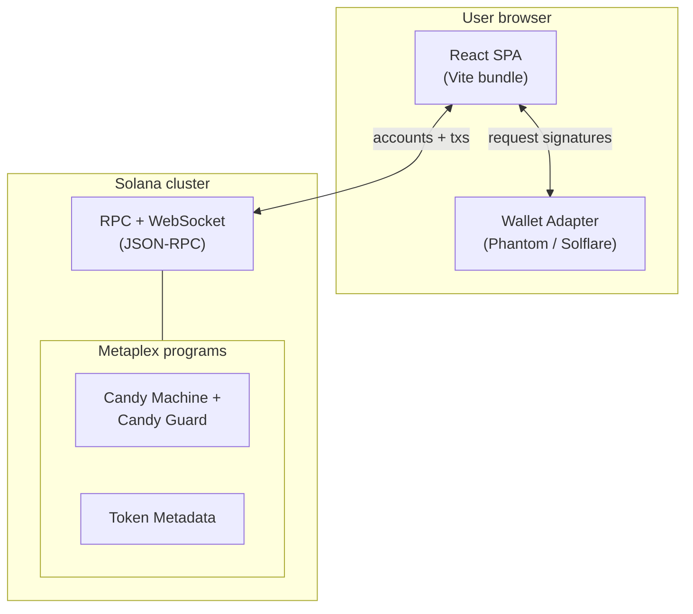

# Flork Site

Official front-end for **$FLORK CTO Solana**: a React single-page application that combines a marketing landing experience with Solana NFT minting powered by Metaplex Candy Machine v3.

**Repository:** [github.com/soladdev/flork-site](https://github.com/soladdev/flork-site)

---

## Overview

Flork Site is a client-side web application served as static assets after build. Users browse informational sections on the home route (`/`) and connect a Solana wallet on the mint route (`/mint`) to interact with on-chain programs through signed transactions.

The UI layer is built with **React 18** and bundled by **Vite 6**, which provides fast dev startup, Hot Module Replacement (HMR), and an optimized production build. Routing uses **React Router** so navigation between landing and minting flows happens without full page reloads.

---

## Architecture

The diagram below shows how the browser app relates to wallets and the Solana cluster.



**Reading the diagram:** The SPA sends read requests and serialized transactions to an RPC endpoint. The user’s wallet extension or app holds private keys and only signs what the user approves; keys never leave the wallet. Minting logic targets Metaplex programs (Candy Machine, guards, token metadata) through the **Umi** client and **`@solana/web3.js`** connection utilities.

---

## Technology stack

### Core application

| Technology | Role |
|------------|------|
| **React 18** | Component model, concurrent features, and client-side rendering via `react-dom`. |
| **Vite 6** | Dev server, ES module-based bundling, and production builds. Uses `@vitejs/plugin-react` for JSX and Fast Refresh. |
| **React Router 7** | Declarative routes: `/` (landing), `/mint` (minting). |
| **ESLint 9** | Static analysis with React, hooks, and refresh plugins (`eslint.config.js`). |

### Styling and motion

| Technology | Role |
|------------|------|
| **styled-components** | Component-scoped CSS-in-JS for layout and theme-friendly styling. |
| **Emotion (`@emotion/styled`)** | Additional styled primitives where used in components. |
| **Framer Motion** | Declarative animations and gestures. |
| **GSAP** | Timeline and fine-grained animation control (for example in hero and agent sections). |
| **CSS modules** | Locally scoped classes where `.module.css` files are used. |
| **react-animated-cursor** | Custom cursor behavior on the landing experience. |
| **react-icons** | Icon set without bundling entire font packs. |

### Solana and Metaplex

| Technology | Role |
|------------|------|
| **`@solana/web3.js`** | Low-level Solana primitives: `Connection`, transaction types, and cluster communication. |
| **Wallet Adapter (`@solana/wallet-adapter-*`)** | React context providers and UI for connecting **Phantom** and **Solflare**, auto-connect, and modal flow. |
| **Umi (`@metaplex-foundation/umi` + bundles)** | Metaplex’s modular client: RPC, identities, and program plugins. |
| **`umi-signer-wallet-adapters`** | Bridges the Solana wallet adapter identity into Umi so minting uses the connected wallet. |
| **`mpl-candy-machine`** | Candy Machine v3: fetch machine/guard state, build **mint** transactions (including guard routes like allow lists). |
| **`mpl-candy-guard`** | Guard configuration and proofs used at mint time. |
| **`mpl-token-metadata`** | NFT metadata standards and digital asset types (e.g. `TokenStandard`). |
| **`mpl-toolbox`** | Helpers such as compute budget instructions (`setComputeUnitLimit` / `setComputeUnitPrice`) and SOL transfers alongside mint flows. |
| **`@solana/spl-token`** | SPL Token types and helpers when interacting with token accounts. |

### Build and runtime details

- **`type: "module"`** in `package.json`: native ES modules in Node tooling and Vite.
- **Vite `resolve.alias`**: maps `stream` to `stream-browserify` so dependencies expecting Node’s `stream` work in the browser bundle.
- **Custom Rollup input**: single `index.html` entry; **`.cur` cursor assets** emit to `cursors/` with names preserved.
- **`assetsInlineLimit: 0`**: avoids inlining assets as data URLs so binary and large files stay as separate requests.

---

## Environment variables

Create a `.env` (or `.env.local`) file in the project root. Only variables prefixed with `VITE_` are exposed to the client bundle.

| Variable | Purpose |
|----------|---------|
| `VITE_SOLANA_RPC` | HTTP(S) RPC URL for `ConnectionProvider` and cluster access. |
| `VITE_SOLANA_WEBSOCKET_RPC` | WebSocket URL for subscriptions (passed through connection config where used). |

If `VITE_SOLANA_RPC` is unset in code paths that define a fallback, local development may still use defaults in specific hooks (for example devnet in `useUmi`); production deployments should always set RPC endpoints explicitly.

---

## Getting started

**Prerequisites:** [Node.js](https://nodejs.org/) (LTS recommended) and a package manager (`npm`, `pnpm`, or `yarn`).

```bash
git clone https://github.com/soladdev/flork-site.git
cd flork-site
npm install
```

**Scripts** (from `package.json`):

| Command | Description |
|---------|-------------|
| `npm run dev` | Start Vite dev server (HMR). |
| `npm run build` | Production build to `dist/`. |
| `npm run preview` | Serve `dist/` on `0.0.0.0` (default port from config: `4173` or `PORT`). |
| `npm run lint` | Run ESLint on the project. |

The dev and preview servers bind to **`0.0.0.0`** in `vite.config.js`, which is convenient in containers or remote development; adjust if you need localhost-only binding.

---

## Project structure (high level)

| Path | Description |
|------|-------------|
| `src/main.jsx` | App entry: `StrictMode`, `BrowserRouter`, wallet providers, root render. |
| `src/App.jsx` | Route definitions. |
| `src/pages/` | Top-level pages (`Landing`, `Minting`). |
| `src/components/` | Feature UI: hero, mint, wallet, carousel, footer, etc. |
| `src/hooks/useUmi.js` | Umi instance with Candy Machine + token metadata plugins and wallet identity. |
| `src/components/Mint/` | Wallet shell, Solana config, mint and checker helpers. |
| `public/` | Static assets served as-is. |
| `vite.config.js` | Build, server, alias, and asset rules. |

---

## Contributing

The npm package is marked **`private`** in `package.json` (not intended for publication to the public npm registry). For contribution or deployment guidelines, coordinate with your team or use the [GitHub repository](https://github.com/soladdev/flork-site).
